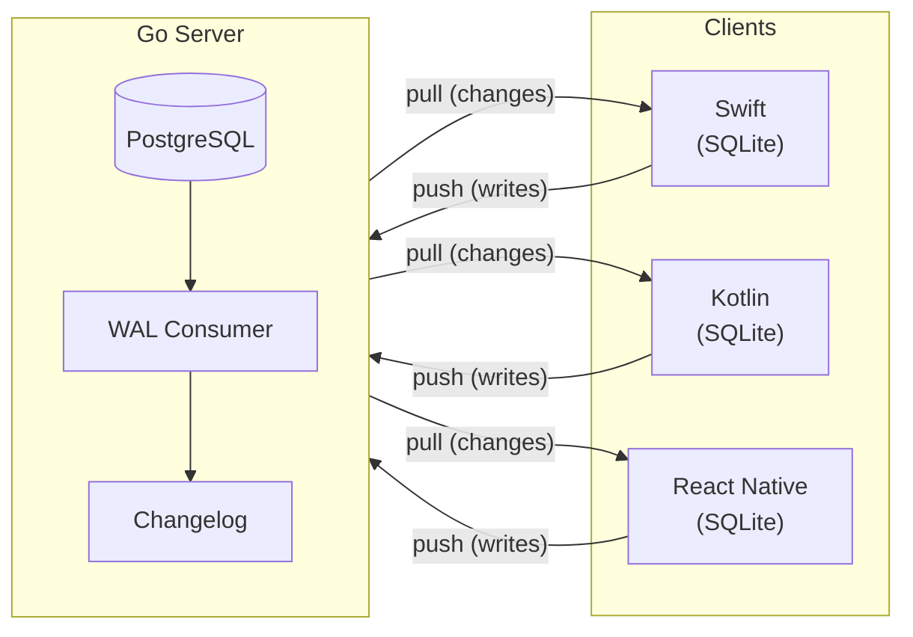

<p align="center">
  <br><br>
  <a href="https://github.com/trainstar/synchro/actions/workflows/release.yml"></a>
  <a href="https://pkg.go.dev/github.com/trainstar/synchro"></a>
  <a href="https://pkg.go.dev/github.com/trainstar/synchro"></a>
  <a href="https://www.npmjs.com/package/@trainstar/synchro-react-native"></a>
  <a href="https://central.sonatype.com/artifact/fit.trainstar/synchro"></a>
  <a href="https://github.com/trainstar/synchro"></a>
  <a href="LICENSE"></a>
  <a href="https://trainstar.github.io/synchro"></a>
</p>

<p align="center">Offline-first sync between PostgreSQL and native client SDKs for Swift, Kotlin, and React Native. Go server you can embed or deploy standalone. Your tables. Minimal changes.</p>

---

## How It Works



Every client reads and writes to a local SQLite database using standard SQL. Synchro syncs changes bidirectionally with your PostgreSQL server in the background. WAL-based change detection means no triggers, no polling, no custom APIs. Conflicts are resolved automatically using last-writer-wins with configurable strategies.

## Why Synchro

- **Native SQL interface.** Clients write directly to SQLite the same way you'd write to any database. No proprietary query language, no object wrappers, no SDK-specific APIs.
- **Full bidirectional sync with conflict resolution.** Reads and writes sync automatically. Not read-only replication, not bring-your-own-write-path.
- **WAL-based change detection.** PostgreSQL logical replication captures changes at the database level. No triggers, no polling, no application-layer diffing.
- **RLS-enforced authorization.** Row-level security policies in Postgres guard your data. Authorization lives in the database, not in application code.
- **Embed or deploy standalone.** Import as a Go library into your existing server, or run `synchrod` as a standalone binary. Scale without rewriting.
- **Native SDKs.** Swift, Kotlin, and React Native. Local SQLite, automatic change tracking, background sync, offline queue.

## Quick Start

### Install

```bash
# Server (Go library)
go get github.com/trainstar/synchro
```

```swift
// Swift (SPM)
.package(url: "https://github.com/trainstar/synchro.git", from: "0.1.2")
```

```kotlin
// Kotlin (Gradle)
implementation("fit.trainstar:synchro:0.1.2")
```

```bash
# React Native
npm install @trainstar/synchro-react-native
```

### Server Setup

Register the tables you want to sync and wire the HTTP endpoints. Synchro handles the rest: WAL subscription, changelog management, conflict resolution, and client state tracking.

```go
registry := synchro.NewRegistry()
registry.Register(&synchro.TableConfig{
    TableName:   "tasks",
    OwnerColumn: "user_id",
})
registry.Register(&synchro.TableConfig{
    TableName:    "comments",
    OwnerColumn:  "user_id",
    ParentTable:  "tasks",
    ParentColumn: "task_id",
})

engine, _ := synchro.NewEngine(synchro.Config{
    DB:       db,
    Registry: registry,
})

h := handler.New(engine)
http.HandleFunc("POST /sync/register",  h.ServeRegister)
http.HandleFunc("POST /sync/pull",      h.ServePull)
http.HandleFunc("POST /sync/push",      h.ServePush)
http.HandleFunc("POST /sync/snapshot",  h.ServeSnapshot)
http.HandleFunc("GET /sync/tables",     h.ServeTableMeta)
http.HandleFunc("GET /sync/schema",     h.ServeSchema)
```

### Client Usage

Every client SDK exposes the same interface: `query()` for reads, `execute()` for writes. You write standard SQL against a local SQLite database. Changes sync automatically in the background.

**Swift**

```swift
let client = try SynchroClient(config: SynchroConfig(
    dbPath: dbPath, serverURL: url,
    authProvider: { token }, clientID: deviceID, appVersion: "1.0.0"
))
try await client.start()

// Write locally, syncs to server automatically
try client.execute("INSERT INTO tasks (id, user_id, title) VALUES (?, ?, ?)",
    params: [uuid, userId, "Ship v1"])

// Read from local SQLite, always fast
let tasks = try client.query("SELECT * FROM tasks WHERE completed = 0")
```

**Kotlin**

```kotlin
val client = SynchroClient(SynchroConfig(
    dbPath = "synchro.db", serverURL = url,
    authProvider = { token }, clientID = deviceId, appVersion = "1.0.0"
), context)
client.start()

// Write locally, syncs to server automatically
client.execute("INSERT INTO tasks (id, user_id, title) VALUES (?, ?, ?)",
    listOf(uuid, userId, "Ship v1"))

// Read from local SQLite, always fast
val tasks = client.query("SELECT * FROM tasks WHERE completed = 0")
```

**React Native**

```typescript
const client = new SynchroClient({
    dbPath: 'synchro.db', serverURL: url,
    authProvider: () => getToken(), clientID: deviceId, appVersion: '1.0.0',
});
await client.initialize();
await client.start();

// Write locally, syncs to server automatically
await client.execute('INSERT INTO tasks (id, user_id, title) VALUES (?, ?, ?)',
    [uuid, userId, 'Ship v1']);

// Read from local SQLite, always fast
const tasks = await client.query('SELECT * FROM tasks WHERE completed = 0');
```

## What You Need

| Component | What Changes |
|-----------|-------------|
| Your tables | Add `deleted_at TIMESTAMPTZ NULL` column |
| PostgreSQL | Set `wal_level = logical` (one-time config) |
| Your server | Register tables + wire 6 HTTP endpoints |
| Client app | `query()` and `execute()` against local SQLite |

## Links

- [Documentation](https://trainstar.github.io/synchro)
- [Quick Start Guide](https://trainstar.github.io/synchro/getting-started/quickstart/)
- [Architecture](https://trainstar.github.io/synchro/server/architecture/)
- [API Reference](https://trainstar.github.io/synchro/protocol/api-reference/)
- [License](LICENSE)
